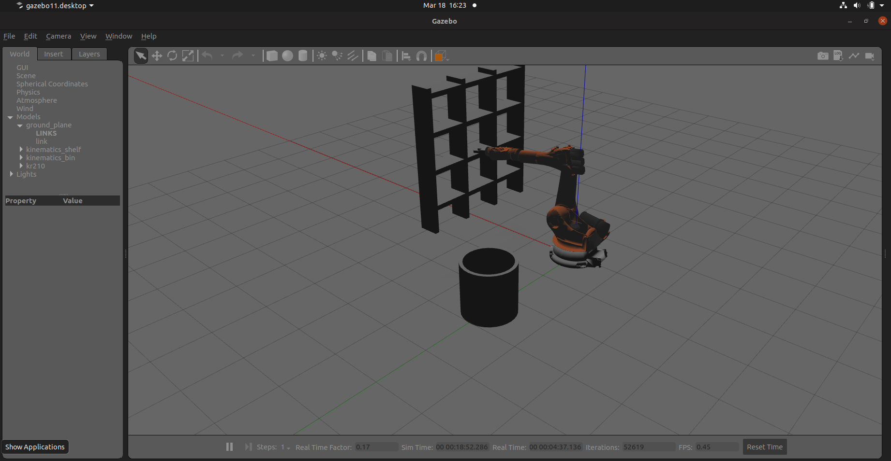
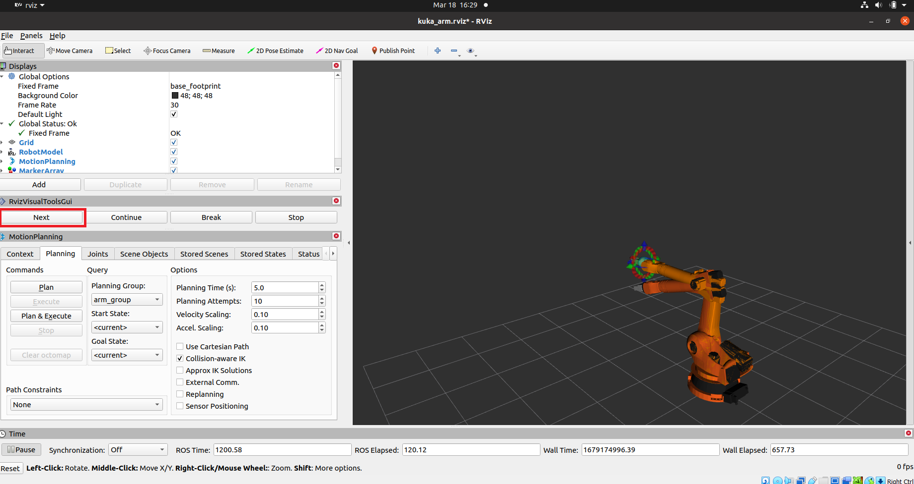

# Pick-and-Place-Robot-with-kuka-arm-and-moveit
### Introduction
The project scene was taken and modified from [udacity pick and place project](https://github.com/udacity/RoboND-Kinematics-Project) sponsored by Amazon Robotics. And the trajectory wa planned using [moveit](https://moveit.ros.org/)

<p align="center">

<br>
<sup><b>Visualization of environment in gazebo</b></sup>
</p>

### Prerequisite
1. Gazebo 11+
2. Ros1(Neotic)
3. Rviz
### Set up project
#### Create a [catkin](http://wiki.ros.org/catkin/) workspace if you haven't created already
```sh
mkdir -p ~/catkin_ws/src
cd ~/catkin_ws/
catkin_init_workspace
```
#### Clone project repository into the *src* directory of the catkin workspace 
```sh
cd ~/catkin_ws/src
git clone https://github.com/Klins101/Pick-and-Place-Robot-with-kuka-arm-and-moveit.git
```
#### Install missing dependencies
```sh
cd ~/catkin_ws
rosdep install --from-paths src --ignore-src --rosdistro=neotic -y
```
#### Make script files executable
```sh
cd ~/catkin_ws/src/pick-place-robot/kuka_arm/scripts
sudo chmod u+x target_spawn.py
sudo chmod u+x IK_server.py
sudo chmod u+x safe_spawner.sh
```
### Build project
```sh
cd ~/catkin_ws
catkin_make
```
#### Add gazebo path to your ~/.bashrc file
```sh
export GAZEBO_MODEL_PATH=~/catkin_ws/src/Pick-and-Place-Robot-with-kuka-arm-and-moveit/kuka_arm/models
```
#### Add source setup.bash
```sh
source ~/catkin_ws/devel/setup.bash
```
#### Launch project by calling the safe_spawner shell script in a fresh terminal
```sh
cd ~/catkin_ws/src/Pick-and-Place-Robot-with-kuka-arm-and-moveit/kuka_arm/scripts
./safe_spawner.sh
```
#### Run the `IK_server` node from another terminal  

```sh
cd ~/catkin_ws/src/Pick-and-Place-Robot-with-kuka-arm-and-moveit/kuka_arm/scripts
rosrun kuka_arm IK_server.py
```
Click on **Next** button on left side of RViz to change states
<p align="center">

<br>
<sup><b>Rviz next</b></sup>
</p>